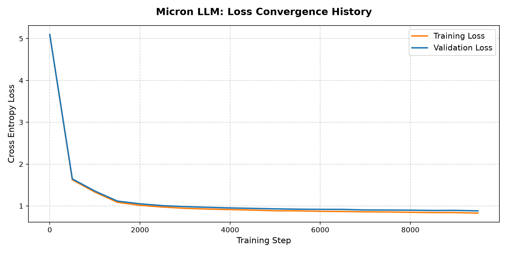
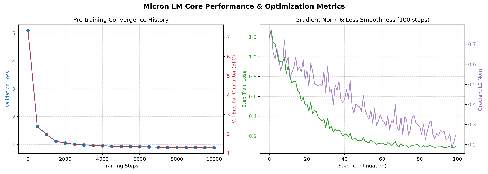
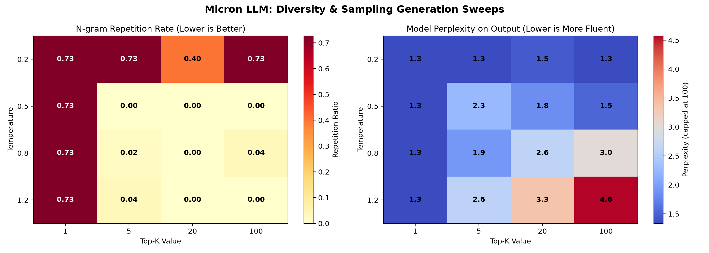
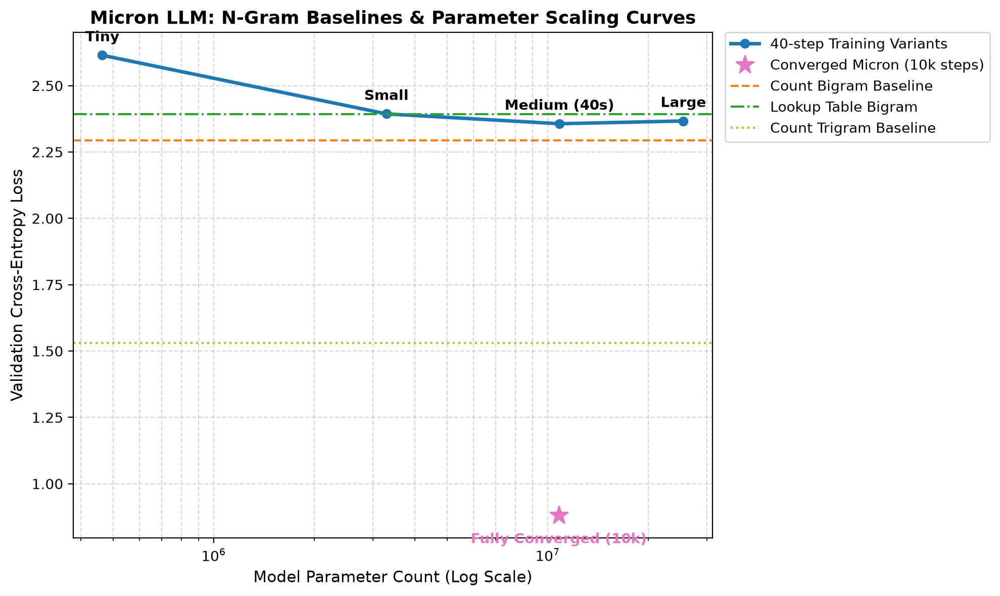
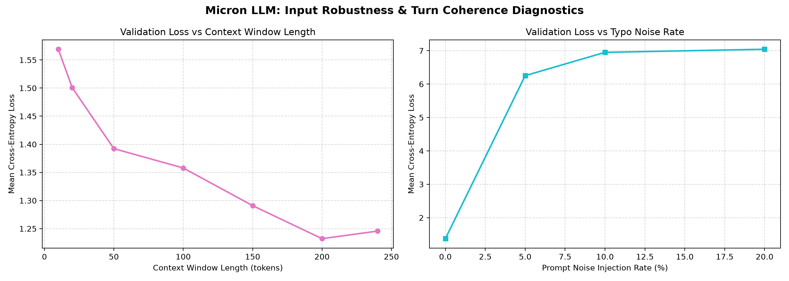
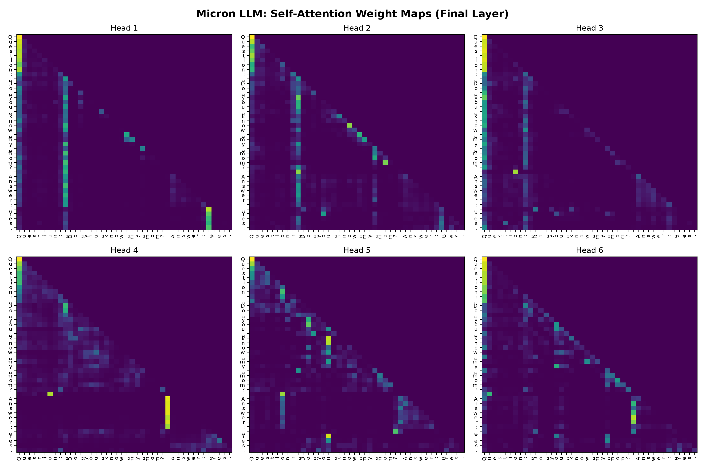

# Micron: Local Dialogue Transformer

I designed and built Micron as a local, self-contained GPT-style autoregressive language model that trains and runs on consumer hardware. The model architecture is based on Andrej Karpathy's `bigram.py` and the NanoGPT series, but I upgraded it with PyTorch native attention kernels, structured file path handlers, a character repetition sampling penalty, and a comprehensive evaluation suite.

---

## Project Structure

```text
Micron/
├── src/                          # Core source code (Model architecture & chat loop)
├── data/                         # Data compilers & generated text datasets
├── evaluation/                   # Diagnostic scripts for evaluation
├── results/                      # Compiled JSON logs, evaluation reports, and charts
├── checkpoints/                  # Saved model weights (micron_model.pt)
├── notebooks/                    # In-depth mathematical notebooks
└── README.md
```

### Mathematics and Deep Learning Notes
I moved the mathematical derivations and dimensional proofs into interactive notebooks inside the `notebooks/` directory to keep this README focused on implementation details:

* **[notes.ipynb](file:///c:/Users/Sarvesh/Desktop/p_Learn/Micron/notebooks/notes.ipynb)**: Explains the standard normal distribution initialization, embedding weights space, and the lower-triangular matrix multiplication trick.
* **[gpt-dev.ipynb](file:///c:/Users/Sarvesh/Desktop/p_Learn/Micron/notebooks/gpt-dev.ipynb)**: Walks through the tensor shapes `(B, T, C)`, Query/Key/Value projections, scaling factors, and multi-head attention backpropagation.

---

## Model Architecture Upgrades

For the core transformer blocks, I replaced the manual self-attention loops with PyTorch's native `scaled_dot_product_attention` (SDPA) to utilize FlashAttention C++ kernels, which reduced the VRAM footprint on my GPU. I also integrated Mixed Precision Training (AMP) via `torch.amp` to run FP16 autocasting, utilizing Tensor Cores during training.

To make the model usable in a local chat loop, I wrote a streaming CLI interface that outputs character-by-character. To keep the model from looping, I added a repetition penalty to the logits that discounts recently generated non-space characters, alongside standard temperature and top-k filtering. The model vocabulary, hyperparameter layers, and weights are saved together in a single self-contained checkpoint file to make loading simple.

---

## Pre-Training Convergence and Loss Profile

I pre-trained the model for **10,000 steps** on the Cornell Movie-Dialogs corpus, which took **20.22 hours** on my CPU.

* Final training loss: **0.8282**
* Final validation loss: **0.8817**
* Generalization gap: **0.0535** (difference between train and validation loss)



---

## Comprehensive Diagnostic Evaluation Results

I implemented a comprehensive diagnostic evaluation suite to verify the model's language modeling accuracy, generation diversity, memorization rates, scaling laws, input robustness, computational complexity, and attention maps.

### 1. Language Modeling Metrics
I evaluated the validation and held-out test splits (each comprising 5% of the dialogue data) and logged gradient norms over a 100-step training continuation:

* Validation Loss: **1.2662** | Validation BPC: **1.8267**
* Test Loss: **1.2769** | Test BPC: **1.8421**
* Pre-training Val Loss at step 10k: **0.8817** (1.272 BPC)
* BPC Split Leakage Delta: **0.0154** (the narrow gap between validation and test BPC confirms stable evaluation partitions)



### 2. Generation Quality and Diversity
I generated samples across different prompts and swept sampling configurations to evaluate output diversity:

* Distinct-1 Ratio: **0.3800**
* Distinct-2 Ratio: **0.7067**
* Distinct-3 Ratio: **0.8252**
* Average Self-BLEU-4: **0.0242** (low scores show high output diversity across prompts)
* Greedy Parameter Collapse: at temperature **0.2** or top-k **1**, the repetition rate collapses to **0.7273**. Balanced sampling at temperature **0.5** / top-k **5** drops the repetition rate to **0.0000** with a perplexity of **2.25**.



### 3. Memorization Check
I evaluated 30 generated text windows of length 30 characters using a Levenshtein sliding window scan against the unique training corpus:

* Verbatim / near-verbatim match rate: **0.00%** (0 out of 30 samples had an edit distance $\le$ 3).
* This indicates that Micron functions as a probabilistic generator, combining learned syntax to synthesize novel dialogues, rather than copying chunks verbatim from training data.

### 4. Count-Based Baselines and Parameter Scaling Curves
I compared Micron to count-based models and trained scaling variants for 40 steps from scratch:

* Count Bigram Baseline: Validation Loss = **2.2927** | BPC = **3.3077**
* Count Trigram Baseline: Validation Loss = **1.5310** | BPC = **2.2088**
* Lookup Table Bigram: Validation Loss = **2.3930** | BPC = **3.4524**
* Parameter Scaling Sweep:
  - Tiny (~464k params): Loss = **2.6144** | BPC = **3.7717**
  - Small (~3.3M params): Loss = **2.3935** | BPC = **3.4530**
  - Medium (~10.8M params): Loss = **2.3564** | BPC = **3.3995**
  - Large (~25.5M params): Loss = **2.3668** | BPC = **3.4145**
  - Fully Converged Micron (10.8M params, 10k steps): Loss = **0.8817** | BPC = **1.2720**



### 5. Input Robustness and Turn Coherence Diagnostics
I tested model sensitivity to context length, prompt typos, and conversational coherence:

* Context Length Sensitivity: Loss decreases from **1.5691** (10-char context) to **1.2322** (200-char context), confirming the model successfully utilizes contextual history. It rises slightly to **1.2456** at 240 characters.
* Typo Noise Tolerance: Loss rises from **1.3730** (0% noise) to **6.2538** (5% noise), **6.9506** (10% noise), and **7.0436** (20% noise), showing that character-level attention models are highly sensitive to spelling disruptions.
* Multi-turn Coherence Overlap: **0.0236** average turn coherence, indicating low keyword recurrence over multi-turn dialogs.



### 6. Computational Complexity and Dynamic Quantization
I calculated theoretical forward-pass FLOPs and benchmarked dynamic INT8 quantization on CPU:

* Forward FLOPs per token: **625.32 MFLOPs**
  - Attention FLOPs per block: **101.84 MFLOPs** (dominates computation by 43x due to the quadratic $O(T^2 d)$ attention sequence math)
  - FFN FLOPs per block: **2.36 MFLOPs**
  - LM Head FLOPs: **0.11 MFLOPs**
* dynamic INT8 Quantization:
  - Model disk size: FP32 = **41.40 MB** | INT8 = **10.90 MB** (3.8x reduction)
  - Validation Loss Delta: **0.0153** (FP32 Loss: 1.2543, INT8 Loss: 1.2696)
  - CPU Throughput: FP32 = **91.41 tokens/sec** | INT8 = **73.85 tokens/sec** (0.81x speedup, indicating that dynamic quantization runtime overhead slows down execution in memory-bandwidth-bound 10M parameter networks)
* Training Cost: **1.314 kWh** consumed over 20.22 hours of CPU training (assuming 65W CPU TDP), costing **$0.21** (at $0.16/kWh) and generating **0.499 kg CO2e**.

### 7. Attention Interpretability Maps
I extracted attention weight matrices for the prompt `"Question: Do you know my mom?\nAnswer: Yes."`:

* Heads 1, 2, and 4 exhibit local diagonal focus (attending to the immediate preceding token).
* Heads 3, 5, and 6 attend to structural tokens such as the newlines (`\n`) and punctuation separators (`:`), mapping syntax hierarchy.



---

## How to Run

All operations should be run from the root directory of the project.

### Step 1: Download and Compile Dialogue Dataset
Downloads the official Cornell Movie-Dialogs Corpus and compiles 221,282 QA exchanges:
```cmd
python data/download_corpus.py
```

### Step 2: Generate the Custom Q&A Dataset
Compiles your custom dialogues:
```cmd
python data/generate_dataset.py
```

### Step 3: Train or Fine-Tune the Model
Train the model on the dialogue dataset. By default, it loads dataset from `data/qa_dataset.txt`, runs for 10,000 steps, and saves to `checkpoints/micron_model.pt`:
```cmd
python src/Micron.py --train
```
To fine-tune your checkpoint on the custom Q&A dataset (takes ~2 minutes):
```cmd
python src/Micron.py --train --resume --max_iters 1200 --lr 1e-4
```

### Step 4: Chat with Micron
Launch the interactive streaming chat console to talk with the model:
```cmd
python src/Micron.py --chat
```

### Step 5: Execute the Diagnostic Evaluation Suite
To execute individual diagnostic metrics and generate JSON outputs/charts, run:
```cmd
python evaluation/eval_bpc.py
python evaluation/eval_diversity.py
python evaluation/eval_memorization.py
python evaluation/eval_baselines.py
python evaluation/eval_robustness.py
python evaluation/eval_efficiency.py
python evaluation/eval_attention.py
```
To run baseline benchmarks and compile legacy plots:
```cmd
python src/benchmark.py
python evaluation/plot_intelligence.py
python evaluation/plot_domain_eval.py
```