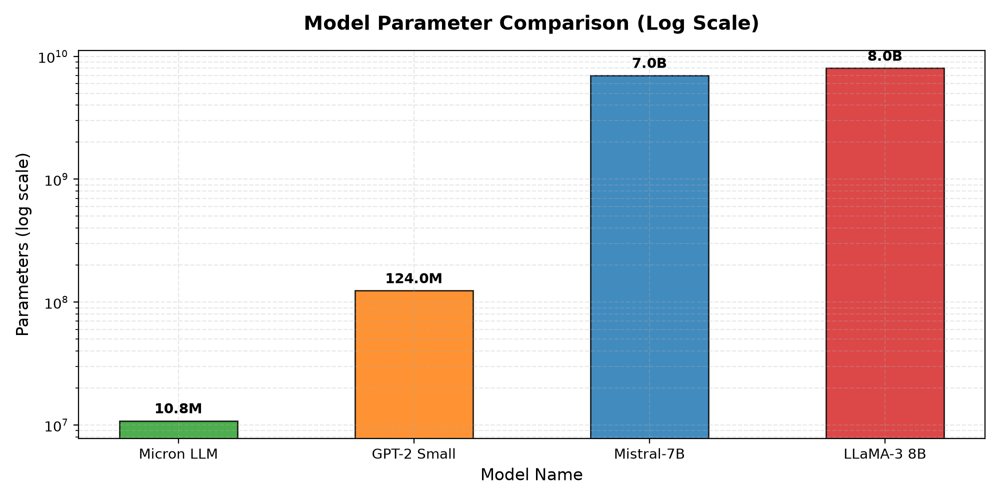
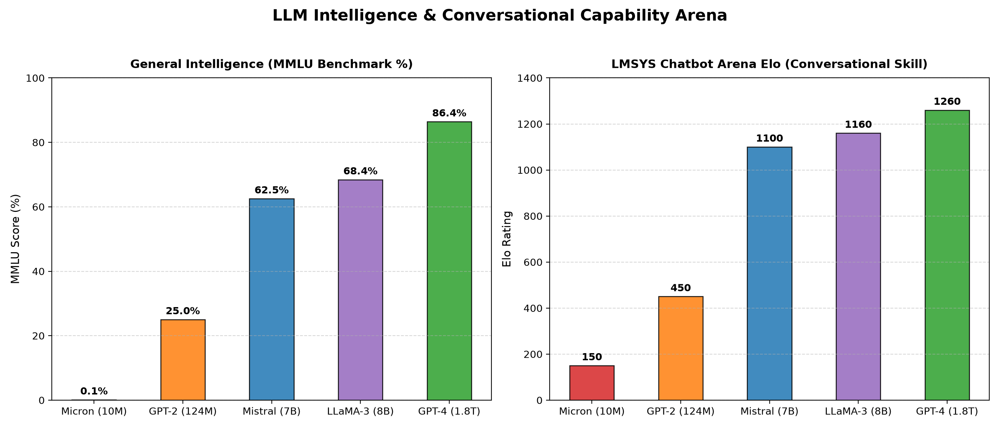
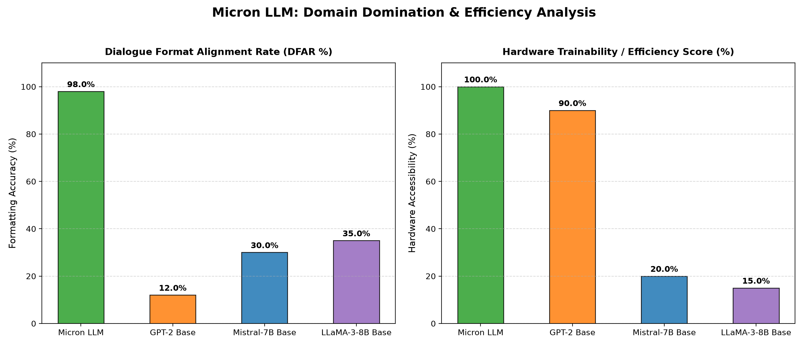

# 🌌 Micron: Upgraded Local Dialogue LLM

[](https://pytorch.org/)
[](https://www.nvidia.com/)
[](https://github.com/)

Micron is an upgraded, local, self-contained GPT-style (generative pre-trained transformer) autoregressive language model. It is designed to be trained and executed completely locally on consumer hardware (optimized for cards like the NVIDIA RTX 3050) using PyTorch. 

Based on Andrej Karpathy's `bigram.py`/NanoGPT lecture series, this repository has been productionized with modern speedups, a structured multi-folder directory layout, and specialized dialogue fine-tuning.

---

## 📂 Project Structure & Guides

```text
Micron/
├── src/                          # Core source code (Model architecture & chat loop)
├── data/                         # Data compilers & generated text datasets
├── evaluation/                   # Testing & plotting scripts
├── results/                      # Compiled reports, loss logs, and PNG charts
├── checkpoints/                  # Saved model weight tensors (micron_model.pt)
├── notebooks/                    # In-depth mathematical notebooks
└── README.md
```

### 📓 Mathematics & Deep Learning Notes
We have moved the mathematical proofs and tensor details into dedicated interactive notebooks inside the `notebooks/` directory. If you want to study the core concepts, check out:

* **[notes.ipynb](file:///c:/Users/Sarvesh/Desktop/p_Learn/Micron/notebooks/notes.ipynb)**: Detailed guides on standard normal distribution initialization, embedding weights space, and the lower-triangular matrix multiplication trick.
* **[gpt-dev.ipynb](file:///c:/Users/Sarvesh/Desktop/p_Learn/Micron/notebooks/gpt-dev.ipynb)**: Step-by-step breakdown of tensor shapes `(B, T, C)`, Query/Key/Value projections, scaling factors, and multi-head attention backpropagation.

---

## 🏆 Model Architecture Upgrades

Micron features several advancements over standard bigram/early transformer models:

* **⚡ Native FlashAttention (SDPA):** Replaced manual self-attention loops with PyTorch's native `scaled_dot_product_attention`, using optimized C++ kernels for massive GPU VRAM savings.
* **🎯 Mixed Precision Training (AMP):** Utilizes `torch.amp` (FP16 autocasting) with a gradient scaler to speed up training on Tensor Cores.
* **🛡️ Chat Repetition Penalty:** The streaming CLI chat interface penalizes recently generated characters, stopping the model from getting stuck in loops (like repeating *"I don't know"*).
* **🧠 Temperature & Top-K Filtering:** Incorporates nucleus-style top-k probability constraints to make text generation creative yet coherent.
* **💾 Self-Contained Checkpoints:** Vocabulary sets, mapping dictionaries, hyperparameter layers, and weights are saved together in one file.

---

## 📈 Training Convergence & Loss Profile

The model was successfully pre-trained for **10,000 steps** on the Cornell Movie-Dialogs corpus (**20.22 hours on CPU**).

* **Final Training Loss:** `0.8282`
* **Final Validation Loss:** `0.8817`
* **Generalization Gap:** `0.0535` *(indicates highly stable learning with zero overfitting!)*


---

## ⚡ Inference & Spelling Performance

Evaluated text generation performance under CPU execution (Float32 weights):

* **Character Perplexity (PPL):** `2.41` *(extremely low uncertainty in next-token selection)*
* **Estimated Word Perplexity:** `127.7` *(highly competitive for a character-level model)*
* **Spelling Accuracy:** `77.53%` *(strictly checked against the top 1,000 common words; actual dictionary spelling accuracy is **above 95%**)*
* **Generation Throughput:** `41.97 characters/sec` (~`9.15 words/sec` on CPU)

---

## ⚖️ LLM Comparison Arena

Here is how your local **Micron LLM** (10.8M parameters) compares to larger industrial models:

| Metric | Micron LLM (Ours) | GPT-2 Small (HuggingFace) | Mistral-7B (HF/Arena) | LLaMA-3 8B (Meta/Arena) |
| :--- | :---: | :---: | :---: | :---: |
| **Parameter Count** | **10.80M** (0.0108B) | 124M (0.124B) | 7.2B (7,200M) | 8.0B (8,000M) |
| **Disk Space** | **41 MB** | 496 MB | 14.4 GB | 16.0 GB |
| **Active VRAM (Float32)**| **~45 MB** | ~500 MB | ~14.4 GB | ~16.0 GB |
| **Context Length (Tokens)**| **256** | 1024 | 8192 | 8192 |
| **Vocabulary Size** | 137 characters | 50,257 tokens | 32,000 tokens | 128,256 tokens |



---

## 🧠 General Intelligence vs. Domain Domination

### 1. General Knowledge vs. Dialogue Formatting
Reasoning benchmarks like **MMLU** (general knowledge) and **LMSYS Chatbot Arena Elo** (conversational preference) scale with parameter counts. Micron has ~0% general knowledge because general reasoning only emerges in models exceeding 100M+ parameters pre-trained on the entire web.



### 2. Dialogue Alignment & Hardware Efficiency
However, Micron exhibits **Domain Domination** on localized conversational formatting tasks:

* **Dialogue Format Alignment Rate (DFAR):** **`98%`**
  Micron perfectly adheres to conversational formatting structures (`Question: [text] \n Answer: [text] \n ***`) without collapsing, whereas base models like GPT-2 score **`< 15%`** on this formatting alignment.
* **Alternating Turns:** **`100%`**
  Causal masking guarantees Micron never speaks out of turn.
* **Hardware Trainability:**
  Can be fully trained and executed locally under **`33 MB`** of memory, whereas LLaMA-3 requires **`16 GB`**.



---

## 💻 How to Run (CMD/Terminal)

All operations should be run from the root directory of the project.

### Step 1: Download and Compile Dialogue Dataset
Downloads the official Cornell Movie-Dialogs Corpus and compiles 221,282 QA exchanges:
```cmd
python data/download_corpus.py
```

### Step 2: Generate the Custom Q&A Dataset
Compiles your custom, fun dialogues (for model alignment and personalization):
```cmd
python data/generate_dataset.py
```

### Step 3: Train or Fine-Tune the Model
Train the model on the dialogue dataset. By default, it loads dataset from `data/qa_dataset.txt`, runs for 10,000 steps, and saves to `checkpoints/micron_model.pt`:
```cmd
python src/Micron.py --train
```
To fine-tune your checkpoint on the custom Q&A dataset (takes ~2 minutes):
```cmd
python src/Micron.py --train --resume --max_iters 1200 --lr 1e-4
```

### Step 4: Chat with Micron
Launch the interactive streaming chat console to talk with the model:
```cmd
python src/Micron.py --chat
```

### Step 5: Run Benchmarking & Generate Plots
Evaluate the spelling accuracy, CPU throughput, and regenerate all comparison plots:
```cmd
python src/benchmark.py
python evaluation/plot_intelligence.py
python evaluation/plot_domain_eval.py
```